<div align="center">

# 👋 Hi, I'm Rachit Sharma

<p align="center">
  
</p>

**Final-year IT Engineering student passionate about building practical tools and intelligent systems.**  
I focus on shipping real, working code—not just tutorials. 

<p align="center">
  <a href="https://rachits.netlify.app/"></a>
  <a href="https://www.linkedin.com/in/rachit-sharma-498108256/"></a>
  <a href="https://dev.to/rachits999003"></a>
  <a href="https://pypi.org/user/rachits999003/"></a>
</p>


</div>

---

## 💼 What I Build

<table>
<tr>
<td width="50%">

### 🐍 Python Development
- Desktop Applications (PyQt5, Tkinter, Flet)
- CLI Tools & Automation
- Published PyPI Packages

</td>
<td width="50%">

### 🤖 Machine Learning
- Classification & NLP Models
- Data Analytics Dashboards
- ML Pipeline Development

</td>
</tr>
<tr>
<td width="50%">

### 🎨 GUI Applications
- Modern Desktop Interfaces
- Interactive Visualizations
- User-Centric Design

</td>
<td width="50%">

### 🔧 Automation & Tools
- File Management Systems
- Smart Downloaders
- Productivity Utilities

</td>
</tr>
</table>

---

## 🛠️ Tech Stack

<div align="center">

### Languages


### ML & Data Science


### Frameworks & Tools


</div>

---

## 🚀 Featured Projects

<details open>
<summary><b>🤖 Machine Learning & AI</b></summary>
<br>

<div align="left">

### 🔹 [AI-Based Fake Review Classifier](https://github.com/rachits999003/AI-Based-Fake-Review-Classifier)
```
ML system to detect AI-generated fake reviews using RandomForestClassifier
```
**Tech Stack:** `scikit-learn` `NLP` `Streamlit` `Pandas`

- ✨ Sentiment and linguistic feature engineering
- 🎯 Interactive Streamlit demo for real-time testing
- 📊 Complete ML pipeline from preprocessing to deployment

---

### 🔹 [Advanced Data Analytics Dashboard](https://github.com/rachits999003/Data-Analysis-and-Analytic-tool)
```
Professional desktop dashboard for comprehensive data analysis
```
**Tech Stack:** `PyQt5` `Matplotlib` `Seaborn` `Plotly` `scikit-learn`

- 📈 Interactive visualizations (histograms, scatter, heatmaps, pair plots)
- 🧠 Built-in ML: classification, regression, K-Means, PCA
- 💾 Export trained models and processed datasets
- 🎨 Modern dark-themed GUI with custom styling

</div>

</details>

<details>
<summary><b>🧩 Algorithms & Problem Solving</b></summary>
<br>

<div align="left">

### 🔹 [Ball Sort Solver](https://github.com/rachits999003/Ball-Sort-Solver)
```
Intelligent puzzle solver using A* algorithm with custom heuristics
```
**Tech Stack:** `Python` `A* Search` `Tkinter` `Algorithm Design`

- 🎯 State-space optimization with intelligent tree pruning
- 🎮 Interactive GUI for puzzle configuration
- ⚡ Step-by-step solution visualization

</div>

</details>

<details>
<summary><b>🔒 Security & System Tools</b></summary>
<br>

<div align="left">

### 🔹 [AI-Powered Malware Detector](https://github.com/rachits999003/AI-powered-Malware-Detector)
```
Desktop malware scanner with YARA rule engine
```
**Tech Stack:** `YARA` `PyQt5` `Security` `Threading`

- 🛡️ YARA rule-based detection engine
- 💻 Full drive scanning with real-time monitoring
- 📊 Progress tracking and detailed threat logging
- 🎨 Modern GUI with smooth animations

</div>

</details>

<details>
<summary><b>📦 Open Source Libraries (PyPI)</b></summary>
<br>

<div align="left">

### 🔹 [pytedit](https://pypi.org/project/pytedit/) | [unitmaster](https://pypi.org/project/unitmaster/)
```
Published and actively maintained Python packages
```

<table>
<tr>
<td width="50%">

**pytedit**
- Terminal-based text editor
- Lightweight & fast
- Available on PyPI

</td>
<td width="50%">

**unitmaster**
- Comprehensive unit converter
- Extensive alias support
- Temperature & standard units

</td>
</tr>
</table>

[](https://pypi.org/project/pytedit/)
[](https://pypi.org/project/unitmaster/)

</div>

</details>

<details>
<summary><b>🔧 Automation & Utilities</b></summary>
<br>

<div align="left">

### 🔹 [File Organizer](https://github.com/rachits999003/File-Organizer)
**Smart file organization with GUI** • Sort by type/date • Auto-categorization

### 🔹 [YouTube Video Downloader](https://github.com/rachits999003/YouTube-Video-Downloader)
**Desktop video downloader** • PyInstaller executable • Clean UI

### 🔹 [Weather Dashboard](https://github.com/rachits999003/Weather-Dashboard)
**CLI weather application** • Geolocation API • Real-time data

</div>

</details>

<details>
<summary><b>🌐 Web & Full-Stack</b></summary>
<br>

<div align="left">

### 🔹 [Kanaka ATS](https://github.com/rachits999003/Kanaka-ATS)
**Applicant Tracking System** • Flask + Vue.js • MongoDB • CV Parser

### 🔹 [AeroPod Rescue](https://github.com/rachits999003/aeropod-rescue)
**GPS Rescue System UI** • React + TypeScript • Framer Motion • 3D Visualizations

</div>

</details>

---

## 📊 GitHub Statistics

<div align="center">
  


</div>

<div align="center">
  


</div>

---

## 🏆 GitHub Trophies

<div align="center">
  


</div>

---

## 📈 Contribution Activity

<div align="center">


</div>

---

## 💡 Current Focus

```mermaid
graph LR
    A[🎓 Graduating 2025] --> B[🚀 Building ML Products]
    B --> C[📦 Open Source]
    C --> D[💼 Job Ready]
    D --> E[🌟 Making Impact]
```

<div align="center">



</div>

---

## 📫 Let's Connect

<div align="center">

<table>
<tr>
<td align="center" width="25%">
<a href="https://rachits.netlify.app/">

<br><b>Portfolio</b>
</a>
</td>
<td align="center" width="25%">
<a href="https://www.linkedin.com/in/rachit-sharma-498108256/">

<br><b>LinkedIn</b>
</a>
</td>
<td align="center" width="25%">
<a href="https://dev.to/rachits999003">

<br><b>Blog</b>
</a>
</td>
<td align="center" width="25%">
<a href="https://pypi.org/user/rachits999003/">

<br><b>PyPI</b>
</a>
</td>
</tr>
</table>

<br>

### 💡 Open to Opportunities

**Full-time roles | Internships | Collaborations**  
*Python Development • Machine Learning • Software Engineering*

<br>


</div>

---

<div align="center">

### ⭐ If you find my work interesting, feel free to explore my repositories! 

**Made with ❤️ and a lot of ☕**

</div>
